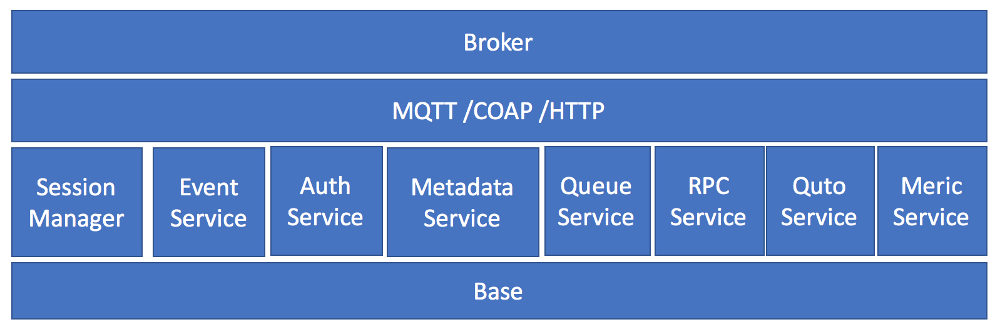

Broker Overview
=====================================================
Broker is package that manage mqtt/caop/http brokers and cooperate with other
brokers for cluster.   
Broker have following sub packages.

* sessionmgr: session manager manage all session shared between brokers.
* event: event service provide a event mechanism to simplify interoperation
  between services or brokers.
* queue: queue service provide queue object to subscribe topic and publish
  topic, it will simplify persistant serialization
* auth: auth service prvoide iot device access authentication and authorization
  service
* coap: coap protocol
* mqtt: mqtt prodoctol
* http: http access protocol for iot
* metadata: metadata service manager all persistant session's meta information
* metrics: metrics service collect brokers status and report to ceilometer
* quto: quto service control quto items, such as max connections
* rpc: rpc service provide api for local broker diag tool
* plugins: plugin mechanism for auth and other service

Architecture
==========================

